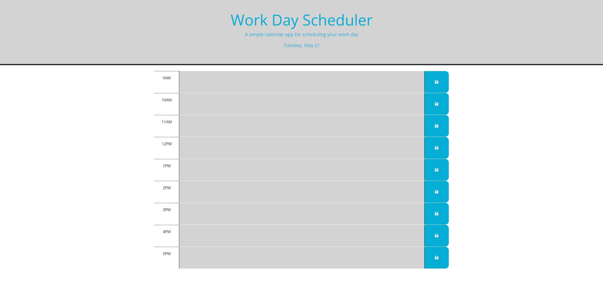

# Challenge5-Day Planner

## Description

In this challenge we are given starter code and asked to complete it and make it a functional day planner with added functionality. We are to combine HTML, CSS, and JQuery to make the planner dynamic so it runs in the browser.

## Installation

-View source code
-Find semantic HTML elements
-View structure of HTML elements
-Find that elements follow logical structure
-View icon and image elements
-Create logic and functionality for planner
-Import Day.js for current day to display
-Create timeblocks from 9am-5pm
-Set color functionality to show past, present, and future
-Save inputs into local storage

## Usage

This is the new and improved home page

Direct link to website

    file:///C:/Users/13059/Desktop/bootcamp/challenges/Challenge1-Code-Refactoring/index.html

## Credits

For help on which HTML semantic elements to use as propper replacements I used W3Schools.

https://www.w3schools.com/html/html5_semantic_elements.asp

For help with CSS selectors i also referred to W3Schools.

https://www.w3schools.com/CSS/css_selectors.asp

For help with JQuery I referenced W3Schools.

https://www.w3schools.com/jquery/default.asp

## License

MIT License

